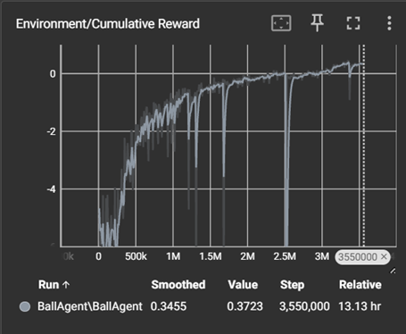
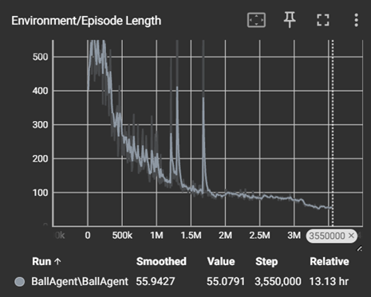

# Tutorial Golf Insanity

## Inhoudstafel

- [Inleiding](#inleiding)
- [Methoden](#methoden)
  - [Installatie](#installatie)
  - [Verloop van het spel](#verloop-van-het-spel)
  - [Observaties, acties en beloningen](#observaties-acties-en-beloningen)
  - [Beschrijving van de objecten](#beschrijving-van-de-objecten)
  - [Gedragingen van de objecten](#gedragingen-van-de-objecten)
  - [Afwijkingen van de one-pager](#afwijkingen-van-de-one-pager)
- [Resultaten](#resultaten)
- [Conclusie](#conclusie)
- [Bronnen](#bronnen)

## Inleiding

_Golf Insanity_ is een AI-gestuurd VR minigolf spel waarin de speler het opneemt tegen een getrainde ML-agent. Voor de implementatie maken we gebruik van de XR Interaction Toolkit en ML-agents binnen Unity.

In deze tutorial leer je hoe je het project kan reproduceren in Unity met gebruik van ML-agents en de XR Interaction toolkit. Je krijgt inzicht in de opbouw van de scène, de observaties en acties van de agent, en hoe beloningen het gedrag verbeteren.

---

## Methoden

### Installatie

Voor dit project is gebruikgemaakt van de volgende softwareversies:

-   Unity versie 6000.0.36f1
-   XR Interaction Toolkit versie 3.0.8
-   ML Agents versie 3.0.0
-   Python 3.9 voor het trainen van de ML-agent

### Verloop van het spel

In Golf Insanity speelt de gebruiker VR minigolf tegen een AI-tegenstander. De speler gebruikt een virtuele golfclub via handtracking of controllers, waarbij de bal in een hole moet worden geslagen binnen een zo beperkt mogelijk aantal slagen. Daarna is het de beurt aan de ML-agent, voorgesteld als de bal zelf, die hetzelfde doel probeert te bereiken. Eens beide spelers aan bod zijn geweest, komt er een leaderboard tevoorschijn met tijdelijke resultaten, dit tot de laatste ronde. Eens de laatste ronde ten einde is, wordt nogmaals de leaderboard getoond met het eindresultaat en een tekst om te tonen of je hebt gewonnen of verloren. De training van deze AI gebeurde vooraf via reinforcement learning en wordt niet live tijdens het spel uitgevoerd.

### Observaties, acties en beloningen

De ML-agent ontvangt tijdens het trainen volgende observaties:

-   Ray Perception Sensor 3D
-   De relatieve kijkrichting van de bal t.o.v. de hole
-   De afstand tussen bal en hole
-   Snelheid van de bal
-   Een boolean of de agent kan schieten (ligt de bal stil?)

Acties die de agent kan uitvoeren:

-   De richting aanpassen waarin geslagen wordt
-   De kracht van het schot bepalen

Beloningen:

-   Positieve beloning bij het bereiken van de hole (1f)
-   Negatieve beloning bij elke slag (-0.01f)
-   Kleine negatieve beloning bij elke timestep (-0.001f)

### Beschrijving van de objecten

De scène bevat de volgende objecten:

-   Een blauwe golfbal die bestuurd wordt door de speler.
-   Een rode golfbal (tegenstander) met een Rigidbody, SphereCollider, Behaviour parameters, Agent script en een Decision requester.
-   Een aim object met de Ray Perception sensor (detectable tags: Wall, Hole). Dit object bepaald de schietrichting van de agent. Dit is een apart object omdat de bal rolt wat de schietrichting aanpast en de ray perception sensors naar alle kanten laat kijken.
-   Een HoleDetector met een istrigger collider en de ‘Hole’ tag zodat de agent deze kan zien maar er niet tegen botst.
-   Een golfparcours. De onderdelen komen van kenney.nl minigolf kit. Het volledige parkours (behalve de vlag) heeft een collider en de ‘Wall’ tag.
-   Een golfclub object dat door de speler bestuurd wordt.

### Gedragingen van de objecten

-   De speler bestuurt de golfclub via VR-handtracking of controllerinput met behulp van de XR Interaction Toolkit en kan de blauwe bal hiermee slagen.
-   De AI-agent beweegt de rode bal met een AddForce op de rigidbody op basis van het aangeleerde model.
-   Het spel detecteert wanneer een bal de hole bereikt of wanneer het maximaal aantal slagen is bereikt, waarna de episode wordt beëindigd.

### Afwijkingen van de one-pager

Ten opzichte van de oorspronkelijke one-pager hebben we enkele wijzigingen doorgevoerd:

-   De speler maakt eerst al zijn slagen af voordat de agent mag beginnen. Hiervoor deden ze dit om te beurt.
-   De omgeving werd vereenvoudigd om het leerproces te versnellen. Voordat we de agent aan moeilijkere levels wilde laten beginnen moest eerst het mikken en de schietkracht goed getraind zijn.

---

## Resultaten

Onderstaande resultaten zijn afkomstig van TensorBoard en tonen de voortgang van de training van de ML-agent voor het golfspel. In het begin behaalt de agent zeer lage scores, maar na verloop van tijd leert hij effectief het gewenste gedrag aan.

 

De uiteindelijke gemiddelde score ligt net boven nul, terwijl een succesvolle episode idealiter een score van 1 zou opleveren. Dit verschil is te verklaren door de negatieve beloningen die de agent ontvangt bij elke slag, evenals de negatieve feedback die wordt gegeven bij elke stap om te ontmoedigen dat de agent te lang wacht met een actie.

Na ongeveer 3,5 miljoen stappen is de agent doorgaans in staat om een hole in minder dan tien slagen te voltooien, wat als een goed resultaat geldt binnen de context van ons spel.

In de grafieken zijn enkele pieken zichtbaar. Deze ontstaan wanneer de training tijdelijk wordt onderbroken om parameters aan te passen, waarna de training wordt hervat. Voorbeelden van dergelijke aanpassingen zijn wijzigingen in de nauwkeurigheid van het schieten of het maximaal toegestane aantal slagen per episode.

---

## Conclusie

In dit project hebben we een AI-gestuurd VR-minigolf spel ontwikkeld waarin een speler het opneemt tegen een getrainde ML-agent. Uit de resultaten blijkt dat de agent in staat is om het spel te voltooien, meestal binnen de 10 toegelaten slagen.

We merken dat het moeilijk is om de agent te trainen om golfparkours af te leggen die hoogteverschil bevatten omdat de agent nu de vloer ook als muur ziet. We kunnen dit verbeteren door de muren en vloer verschillende tags te geven. Ook zitten agents vaak vast als er een muur in de weg staat. We kunnen dit gedrag afleren door strafpunten te geven als de agent een muur aanraakt.

---

## Bronnen

- Unity Technologies. (z.d.). *ML-Agents Toolkit Documentation*. Geraadpleegd op 8 juni 2025, van https://github.com/Unity-Technologies/ml-agents  
- Unity Technologies. (z.d.). *XR Interaction Toolkit Documentation*. Geraadpleegd op 8 juni 2025, van https://docs.unity3d.com/Packages/com.unity.xr.interaction.toolkit@2.4/manual/index.html  
- Kenney. (z.d.). *Minigolf Kit*. Geraadpleegd op 8 juni 2025, van https://kenney.nl/assets/minigolf-kit  
- OpenAI. (2025). *ChatGPT (GPT-4), versie juni 2025*. Geraadpleegd via https://chat.openai.com  
- GitHub. (2025). *GitHub Copilot*. Geraadpleegd via https://github.com/features/copilot    
- StockTune. (z.d.). *Putt Putt Golf Ball [audio clip]*. Geraadpleegd op 8 juni 2025, van https://stocktune.com/free-music/putt-putt-golf-ball-155554-13793?signup=true  
- Jeniak, A. (2021). *Fatality – FPS Gaming Font*. Unity Asset Store. Geraadpleegd op 8 juni 2025, van https://assetstore.unity.com/packages/2d/fonts/fatality-fps-gaming-font-216954  
- NatureManufacture. (2020). *Low Poly Simple Nature Pack*. Unity Asset Store. Geraadpleegd op 8 juni 2025, van https://assetstore.unity.com/packages/3d/environments/landscapes/low-poly-simple-nature-pack-162153 
